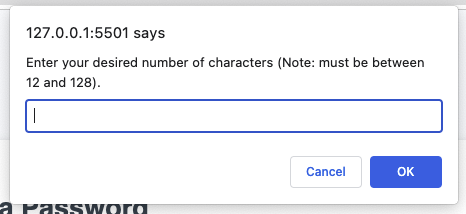

# Password Generator

## Description
  
This program generates a random password following length and character criteria set by the user.

## Installation

No installation needed.

## Usage

To use, first click the "Generate Password" button.

A prompt will appear asking for your desired password length. 

If you enter a number within the defined range (8-128 characters), a series of confirmations will appear, asking if you would like to include uppercase letters, lowercase letters, numbers, and symbols.

After completing the prompts, the program will output a randomized password according to user-specified length and characters.

## Credits

HTML, CSS, and JavaScript starter code provided by Denver University Full Stack Bootcamp.

## Features

Dynamically updated HTML and CSS powered by JavaScript, clickable button, prompts, alerts, and confirmations 
